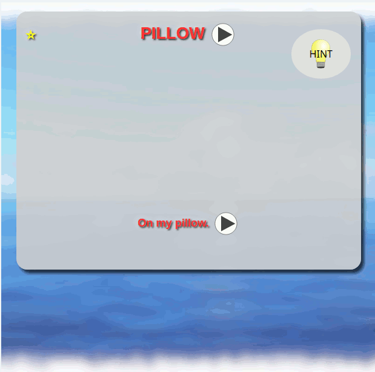

# Ankivocb
Set of decks for basic English-Czech vocabulary and phrases.

Sada balíčků pro učení anglických slovíček a vět do programu Anki.

[Github projekt](https://github.com/Premik/AnkiVocb)

## V kostce
- Zhruba 1000 nejčastějších slov a slovních spojení.
- K anglickému slovu jedno nebo dvě české.
- U každého slova příklad užití ve větě. Komě balíčků, `SimpleWords` a `SimpleVerbs`.
- Kartičky obsahují tlačítko `hint` pro zobrazní nápovědy. Toto odkryje jen první písmeno. Případně více písmenek u delších slov.
- Téměř každá kartička je opatřena obrázkem, který se zobrazí po stisku tlačítka `hint`. Použity byly pouze obrázky označené vyhledávačem Bign jako Public Domain.
- Vešekeré slova i věty jsou **namluvené** syntetizátorem.
  - Vhodné i pro děti, co ještě neumí číst nebo čtou špatně.  
  - Pro angličtinu byl použit Amazon Polly syntetizátor.
  - Bylo použito namátkou 10 různých hlasů, jak s UK tak US přízvukem. U pozdějších balíčku i další přízvuky.
  - Pro češtinu jsou použity dva hlasy z Azure TTS (Microsoft). A občas postarší systentizátor [systému Epos](http://epos.ufe.cz/).
- Balíčky obsahují nejčastější slova ve všech tvarech. Nejedná se jen podstatná jména a třeba slovesa v základním tvaru. Ale i zájména, pomocná slova, různé tvary, (zkrácené) varianty apod. "Syntetický" přístup. Tak, jak se jazyk učí děti o mala.

## Jak začít

* Nainstalujte si program [Anki](https://apps.ankiweb.net/), který je pro PC a Android zadarmo. Dá se používat i čistě webová verze. Postup zde není popsán, [najděte si nějaký návod na internetu](https://duckduckgo.com/?q=anki+n%C3%A1vod).

* Balíčky jsou ke stažení vpravo v odkazu [Releases](https://github.com/Premik/AnkiVocb/releases). Stáhněte buď archív všech balíčků `Ankivocb.apkg` nebo `Ankivocb.crowd.7z` (je třeba `CrowdAnki` plugin) a naimportujte do Anki.

Tip: neimportujte všechny balíčky zároveň. Ideální je načít 2-3 balíčky a až po jejich naučení postupně importovat další. Učení je tak pestřejší.
A taky některé (pokročilé) balíčky předpokládají znalosti z předchozích balíčků. Ale většina balíčků je "samostatných". Proto se některá slova opakovaně vyskytují ve více různých balíčcích. Hlavně ty hodně časté.

Tip: Upravte si denní limit nových kartiček(slov) a kartiček k opakování.

### Úplný začátečník
Pokud ještě neumíte vůbec nic, začněte tady. Jednoduché dětské říkanky a písničky:

- `Toddler`
  - `FiveLittleMonkeys`
  - `LondonBridge`
  - `MaryHadALittleLamb`
  - `MyBonnie`
  - `WheelsOnTheBus`

### Začátečník
Načnout `SimpleVerbs` a `SimpleWords`. Tyto dva balíčky obsahují hodně snadných slov bez vět. Proto se dá učit rychle. Ideální kombinovat ještě s nějakým dalším balíčkem, který obsahuje i věty.

- `Simple`
  - `SimpleVerbs`
  - `SimpleWords`
  - `JingleBells`
  - `MaryHadALittleLamb`
  - `EverythingIsAwesome`
  - `DuckTales`
  - `ThomasAndFriends`

### Mírně pokročilý
Dalších ~800 slov a ~250 vět/frází, které které ještě nebyli v předchozích balíčcích. Teto balíček by se měl učit až mezi posledními:

- `Basic`
  - `Basic1K`

